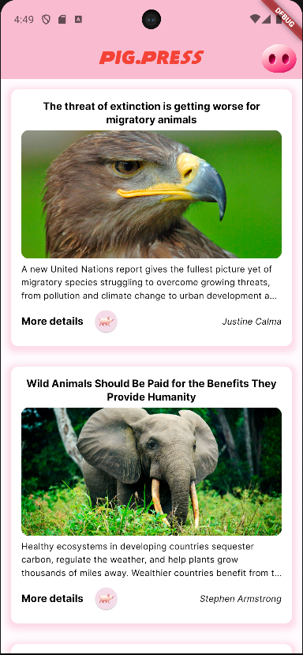
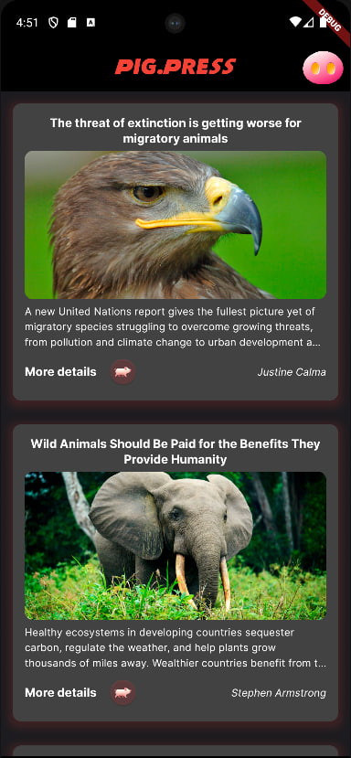

# Pig.Press

Это приложение поможет пользователем отвлечься от тяжелых и грустных новостей, отдохнуть после трудового дня и провести время, просматривая новости о милых и прекрасных животных.

#### Стек технологий

Dart, Flutter

#### Основной экран

- AppBar с названием, справа кнопка в виде пяточка, при нажатии меняется тема и вид иконки.
- Список новостей, каждая новость состоит из названия, картинки, автора и описания.
- Получение новостей происходит с news api с помощью http - запросов
- Снизу новости есть кнопка с картинкой поросенка, которая перенаправляет на окно с более полной информации по конкретной новости.
- Если у новости нет картинки, то отображается надпись о том, что нет картинки

## Светлая тема

## Темная тема

#### Дополнительный экран

- AppBar с названием, справа кнопка в виде пяточка, при нажатии меняется тема и вид иконки.
- Информация о новости, ее название, картинка, автор, контент и кнопка для перехода в браузер с источником новости
- Если у новости нет картинки, то отображается надпись о том, что нет картинки

## Светлая тема

## Темная тема

#### Иконка приложения

#### Реализация

- Поддержана темная и светлая тема с помощью ThemeData
- Подключен линтер
- Подключен logger
- http - запросы для получения новостей
- ChangeNotifierProvider для поддержки текущей темы приложения 
- Подключены сторонние шрифты